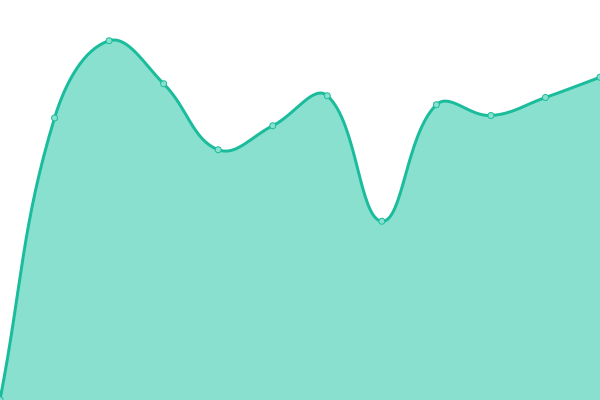

# [📈 Live Status](https://deerwalkrnd.github.io/status): <!--live status--> **🟩 All systems operational**

This repository contains the open-source uptime monitor and status page for [Deerwalk R & D](https://deerwalk.edu.np), powered by [Upptime](https://github.com/upptime/upptime).

With [Upptime](https://upptime.js.org), you can get your own unlimited and free uptime monitor and status page, powered entirely by a GitHub repository. We use [Issues](https://github.com/deerwalkrnd/status/issues) as incident reports, [Actions](https://github.com/deerwalkrnd/status/actions) as uptime monitors, and [Pages](https://deerwalkrnd.github.io/status) for the status page.

<!--start: status pages-->
<!-- This summary is generated by Upptime (https://github.com/upptime/upptime) -->
<!-- Do not edit this manually, your changes will be overwritten -->
<!-- prettier-ignore -->
| URL | Status | History | Response Time | Uptime |
| --- | ------ | ------- | ------------- | ------ |
|  [Deerwalk Classroom](https://classroom.dwit.edu.np) | 🟩 Up | [deerwalk-classroom.yml](https://github.com/deerwalkrnd/status/commits/HEAD/history/deerwalk-classroom.yml) | 

 1427ms
     
 | 

<a href="https://status.deerwalk.edu.np/history/deerwalk-classroom">54.74%</a>
    

|  [Deerwalk Sifal School](https://deerwalk.edu.np/sifal-school) | 🟩 Up | [deerwalk-sifal-school.yml](https://github.com/deerwalkrnd/status/commits/HEAD/history/deerwalk-sifal-school.yml) | 

 116ms
     
 | 

<a href="https://status.deerwalk.edu.np/history/deerwalk-sifal-school">100.00%</a>
    

|  [Deerwalk Foods](https://foods.deerwalk.edu.np) | 🟩 Up | [deerwalk-foods.yml](https://github.com/deerwalkrnd/status/commits/HEAD/history/deerwalk-foods.yml) | 

 157ms
     
 | 

<a href="https://status.deerwalk.edu.np/history/deerwalk-foods">100.00%</a>
    

|  [Deerwalk Institute of Technology](https://deerwalk.edu.np/DWIT/) | 🟩 Up | [deerwalk-institute-of-technology.yml](https://github.com/deerwalkrnd/status/commits/HEAD/history/deerwalk-institute-of-technology.yml) | 

 19ms
     
 | 

<a href="https://status.deerwalk.edu.np/history/deerwalk-institute-of-technology">100.00%</a>
    

|  [Deerwalk Education Group](https://deerwalk.edu.np/) | 🟩 Up | [deerwalk-education-group.yml](https://github.com/deerwalkrnd/status/commits/HEAD/history/deerwalk-education-group.yml) | 

 15ms
     
 | 

<a href="https://status.deerwalk.edu.np/history/deerwalk-education-group">100.00%</a>
    

|  [Deerwalk Dhading School](https://deerwalk.edu.np/dhading-school) | 🟩 Up | [deerwalk-dhading-school.yml](https://github.com/deerwalkrnd/status/commits/HEAD/history/deerwalk-dhading-school.yml) | 

 28ms
     
 | 

<a href="https://status.deerwalk.edu.np/history/deerwalk-dhading-school">100.00%</a>
    

<!--end: status pages-->

[**Visit our status website →**](https://deerwalkrnd.github.io/status)

## 📄 License

- Powered by: [Upptime](https://github.com/upptime/upptime)
- Code: [MIT](./LICENSE) © [Anand Chowdhary](https://anandchowdhary.com), supported by [Pabio](https://pabio.com)
- Data in the `./history` directory: [Open Database License](https://opendatacommons.org/licenses/odbl/1-0/)
