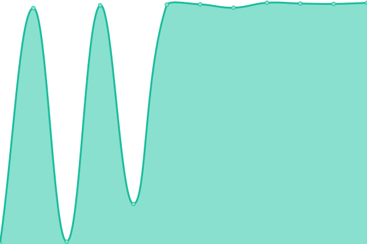

# [📈 Live Status](https://deerwalkrnd.github.io/status): <!--live status--> **🟧 Partial outage**

This repository contains the open-source uptime monitor and status page for [Deerwalk R & D](https://deerwalk.edu.np), powered by [Upptime](https://github.com/upptime/upptime).

With [Upptime](https://upptime.js.org), you can get your own unlimited and free uptime monitor and status page, powered entirely by a GitHub repository. We use [Issues](https://github.com/deerwalkrnd/status/issues) as incident reports, [Actions](https://github.com/deerwalkrnd/status/actions) as uptime monitors, and [Pages](https://deerwalkrnd.github.io/status) for the status page.

<!--start: status pages-->
<!-- This summary is generated by Upptime (https://github.com/upptime/upptime) -->
<!-- Do not edit this manually, your changes will be overwritten -->
<!-- prettier-ignore -->
| URL | Status | History | Response Time | Uptime |
| --- | ------ | ------- | ------------- | ------ |
|  [Deerwalk Classroom](https://classroom.dwit.edu.np) | 🟥 Down | [deerwalk-classroom.yml](https://github.com/deerwalkrnd/status/commits/HEAD/history/deerwalk-classroom.yml) | 

 2635ms
     
 | 

<a href="https://status.deerwalk.edu.np/history/deerwalk-classroom">99.40%</a>
    

|  [Deerwalk Sifal School](https://deerwalk.edu.np/sifal-school) | 🟩 Up | [deerwalk-sifal-school.yml](https://github.com/deerwalkrnd/status/commits/HEAD/history/deerwalk-sifal-school.yml) | 

 340ms
     
 | 

<a href="https://status.deerwalk.edu.np/history/deerwalk-sifal-school">100.00%</a>
    

|  [Deerwalk Foods](https://foods.deerwalk.edu.np) | 🟥 Down | [deerwalk-foods.yml](https://github.com/deerwalkrnd/status/commits/HEAD/history/deerwalk-foods.yml) | 

 1579ms
     
 | 

<a href="https://status.deerwalk.edu.np/history/deerwalk-foods">99.41%</a>
    

|  [Deerwalk Institute of Technology](https://deerwalk.edu.np/DWIT/) | 🟩 Up | [deerwalk-institute-of-technology.yml](https://github.com/deerwalkrnd/status/commits/HEAD/history/deerwalk-institute-of-technology.yml) | 

 57ms
     
 | 

<a href="https://status.deerwalk.edu.np/history/deerwalk-institute-of-technology">100.00%</a>
    

|  [Deerwalk Education Group](https://deerwalk.edu.np/) | 🟩 Up | [deerwalk-education-group.yml](https://github.com/deerwalkrnd/status/commits/HEAD/history/deerwalk-education-group.yml) | 

 52ms
     
 | 

<a href="https://status.deerwalk.edu.np/history/deerwalk-education-group">100.00%</a>
    

|  [Deerwalk Dhading School](https://deerwalk.edu.np/dhading-school) | 🟩 Up | [deerwalk-dhading-school.yml](https://github.com/deerwalkrnd/status/commits/HEAD/history/deerwalk-dhading-school.yml) | 

 145ms
     
 | 

<a href="https://status.deerwalk.edu.np/history/deerwalk-dhading-school">100.00%</a>
    

|  [Deerwalk Training Center](https://deerwalktrainingcenter.com/) | 🟥 Down | [deerwalk-training-center.yml](https://github.com/deerwalkrnd/status/commits/HEAD/history/deerwalk-training-center.yml) | 

 2486ms
     
 | 

<a href="https://status.deerwalk.edu.np/history/deerwalk-training-center">99.72%</a>
    

|  [Doko](https://doko.dwit.edu.np/) | 🟥 Down | [doko.yml](https://github.com/deerwalkrnd/status/commits/HEAD/history/doko.yml) | 

 226ms
     
 | 

<a href="https://status.deerwalk.edu.np/history/doko">21.25%</a>
    

|  [Deerwalk Almuni](https://alumni.dwit.edu.np/) | 🟩 Up | [deerwalk-almuni.yml](https://github.com/deerwalkrnd/status/commits/HEAD/history/deerwalk-almuni.yml) | 

 299ms
     
 | 

<a href="https://status.deerwalk.edu.np/history/deerwalk-almuni">100.00%</a>
    

|  [Deerwalk Learning Center](https://dlc.dwit.edu.np/) | 🟩 Up | [deerwalk-learning-center.yml](https://github.com/deerwalkrnd/status/commits/HEAD/history/deerwalk-learning-center.yml) | 

 1257ms
     
 | 

<a href="https://status.deerwalk.edu.np/history/deerwalk-learning-center">99.74%</a>
    

|  [Deerwalk Project Hub](https://projects.deerwalk.edu.np/) | 🟩 Up | [deerwalk-project-hub.yml](https://github.com/deerwalkrnd/status/commits/HEAD/history/deerwalk-project-hub.yml) | 

 203ms
     
 | 

<a href="https://status.deerwalk.edu.np/history/deerwalk-project-hub">79.34%</a>
    

|  [Deerwalk Intern Manager](https://internmanager.deerwalk.edu.np/) | 🟥 Down | [deerwalk-intern-manager.yml](https://github.com/deerwalkrnd/status/commits/HEAD/history/deerwalk-intern-manager.yml) | 

 95ms
     
 | 

<a href="https://status.deerwalk.edu.np/history/deerwalk-intern-manager">0.00%</a>
    

|  [Deerwalk Library](https://dwitlibrary.deerwalk.edu.np/) | 🟥 Down | [deerwalk-library.yml](https://github.com/deerwalkrnd/status/commits/HEAD/history/deerwalk-library.yml) | 

 1034ms
     
 | 

<a href="https://status.deerwalk.edu.np/history/deerwalk-library">99.72%</a>
    

|  [Deerwalk Job Fair](https://jobfair.dwit.edu.np/) | 🟩 Up | [deerwalk-job-fair.yml](https://github.com/deerwalkrnd/status/commits/HEAD/history/deerwalk-job-fair.yml) | 

 1006ms
     
 | 

<a href="https://status.deerwalk.edu.np/history/deerwalk-job-fair">93.48%</a>
    

|  [Deerwalk Journal](https://journal.deerwalk.edu.np/) | 🟩 Up | [deerwalk-journal.yml](https://github.com/deerwalkrnd/status/commits/HEAD/history/deerwalk-journal.yml) | 

 2369ms
     
 | 

<a href="https://status.deerwalk.edu.np/history/deerwalk-journal">99.80%</a>
    

|  [DWIT News](https://dwitnews.com/) | 🟥 Down | [dwit-news.yml](https://github.com/deerwalkrnd/status/commits/HEAD/history/dwit-news.yml) | 

 197ms
     
 | 

<a href="https://status.deerwalk.edu.np/history/dwit-news">0.00%</a>
    

|  [Deerwalk Resource Manager](https://drm.deerwalkgroup.com) | 🟩 Up | [deerwalk-resource-manager.yml](https://github.com/deerwalkrnd/status/commits/HEAD/history/deerwalk-resource-manager.yml) | 

 191ms
     
 | 

<a href="https://status.deerwalk.edu.np/history/deerwalk-resource-manager">100.00%</a>
    

|  [Deerwalk Vacancy](https://vacancy.deerwalk.edu.np/) | 🟩 Up | [deerwalk-vacancy.yml](https://github.com/deerwalkrnd/status/commits/HEAD/history/deerwalk-vacancy.yml) | 

 179ms
     
 | 

<a href="https://status.deerwalk.edu.np/history/deerwalk-vacancy">99.44%</a>
    

|  [Deerwalk Profiler](https://profiler.deerwalk.edu.np/) | 🟩 Up | [deerwalk-profiler.yml](https://github.com/deerwalkrnd/status/commits/HEAD/history/deerwalk-profiler.yml) | 

 180ms
     
 | 

<a href="https://status.deerwalk.edu.np/history/deerwalk-profiler">100.00%</a>
    

|  [IT4D](http://it4d.org/) | 🟥 Down | [it-4-d.yml](https://github.com/deerwalkrnd/status/commits/HEAD/history/it-4-d.yml) | 

 14252ms
     
 | 

<a href="https://status.deerwalk.edu.np/history/it-4-d">0.00%</a>
    

|  [Tedx](https://tedx.deerwalk.edu.np/login) | 🟥 Down | [tedx.yml](https://github.com/deerwalkrnd/status/commits/HEAD/history/tedx.yml) | 

 764ms
     
 | 

<a href="https://status.deerwalk.edu.np/history/tedx">99.73%</a>
    

|  [Deerwalk Application Manager](https://application.deerwalk.edu.np/) | 🟩 Up | [deerwalk-application-manager.yml](https://github.com/deerwalkrnd/status/commits/HEAD/history/deerwalk-application-manager.yml) | 

 167ms
     
 | 

<a href="https://status.deerwalk.edu.np/history/deerwalk-application-manager">97.06%</a>
    

|  [Sifal School Academic Resource Manager](https://arms.deerwalk.edu.np/) | 🟩 Up | [sifal-school-academic-resource-manager.yml](https://github.com/deerwalkrnd/status/commits/HEAD/history/sifal-school-academic-resource-manager.yml) | 

 1019ms
     
 | 

<a href="https://status.deerwalk.edu.np/history/sifal-school-academic-resource-manager">93.49%</a>
    

|  [Dhading School Academic Resource Manager](https://arms-dds.deerwalk.edu.np/) | 🟩 Up | [dhading-school-academic-resource-manager.yml](https://github.com/deerwalkrnd/status/commits/HEAD/history/dhading-school-academic-resource-manager.yml) | 

 1045ms
     
 | 

<a href="https://status.deerwalk.edu.np/history/dhading-school-academic-resource-manager">93.49%</a>
    

|  [Sifal School Library](https://elibrary.deerwalk.edu.np/) | 🟩 Up | [sifal-school-library.yml](https://github.com/deerwalkrnd/status/commits/HEAD/history/sifal-school-library.yml) | 

 533ms
     
 | 

<a href="https://status.deerwalk.edu.np/history/sifal-school-library">99.43%</a>
    

|  [Sifal School Lesson Plan](https://lessonplansifal.dwit.edu.np/) | 🟥 Down | [sifal-school-lesson-plan.yml](https://github.com/deerwalkrnd/status/commits/HEAD/history/sifal-school-lesson-plan.yml) | 

 14750ms
     
 | 

<a href="https://status.deerwalk.edu.np/history/sifal-school-lesson-plan">21.83%</a>
    

|  [Dhading School Academic Resource Manager](http://arms-dds.deerwalk.edu.np/) | 🟩 Up | [dhading-school-academic-resource-manager.yml](https://github.com/deerwalkrnd/status/commits/HEAD/history/dhading-school-academic-resource-manager.yml) | 

 1045ms
     
 | 

<a href="https://status.deerwalk.edu.np/history/dhading-school-academic-resource-manager">93.49%</a>
    

|  [Deerwalk Jobs](https://jobs.deerwalktrainingcenter.com/) | 🟩 Up | [deerwalk-jobs.yml](https://github.com/deerwalkrnd/status/commits/HEAD/history/deerwalk-jobs.yml) | 

 207ms
     
 | 

<a href="https://status.deerwalk.edu.np/history/deerwalk-jobs">100.00%</a>
    

<!--end: status pages-->

[**Visit our status website →**](https://deerwalkrnd.github.io/status)

## 📄 License

- Powered by: [Upptime](https://github.com/upptime/upptime)
- Code: [MIT](./LICENSE) © [Anand Chowdhary](https://anandchowdhary.com), supported by [Pabio](https://pabio.com)
- Data in the `./history` directory: [Open Database License](https://opendatacommons.org/licenses/odbl/1-0/)
